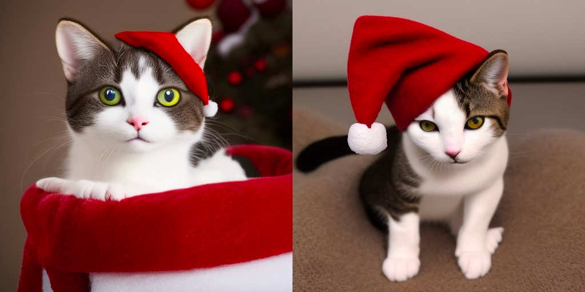

Textual inversion is a technique that allows one to train a new "word" (and get a new embedding for that word)
in the space of all possible tokens out model knows.
As a use you can load this new embedding and use it during the de- noising process. 

A better and more formal description can be found [here](https://huggingface.co/docs/diffusers/training/text_inversion)
A video explaning a topic is part of the stable diffusion [lectures](https://www.youtube.com/watch?v=0_BBRNYInx8&t=3s) by fast.ai. 

Here is an example of leaning a specific watercolor houses drawing *style*. The learned style then transferred to other objects: 

One has to be careful - if guidance to high (how much the denoising should stick to the prompt) - even a cat can become 
watercolor drawing of a house:

Image to image (style transfer) works quite well too, but you have to lower the guidance a bit:

Training an object and not a style yielded nice results 

But failed to locate the learned object correctly in the scene, for example

> Prompt: "photo of *object* driving a red car, yellow eyes, masterpiece, trending, beautiful, sharp focus, cute"
